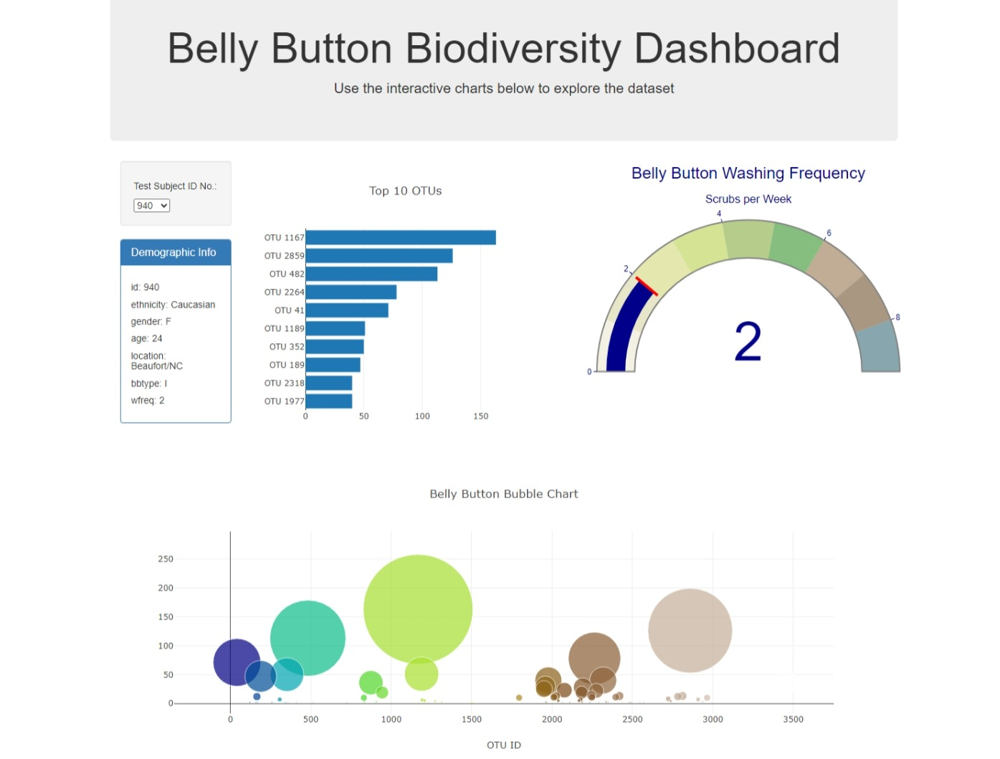

# Belly Button Biodiversity Dashboard

## Project Overview

This project focuses on building an interactive web dashboard to explore the Belly Button Biodiversity dataset, which catalogs the microbes that colonize human navels. The dataset reveals that a small number of microbial species (also called operational taxonomic units, or OTUs, in the study) were present in more than 70% of people, while the rest were relatively rare.

## Getting Started

### Prerequisites

- A modern web browser (e.g., Chrome, Firefox, Safari).
- An internet connection.

### Running the Dashboard

1. Clone this repository to your local machine.
   
   git clone `https://github.com/Beautyojimah/belly-button-challenge.git`

2. Navigate to the project directory using `cd belly-button-challenge`
3. Open the index.html file in your web browser.

## Features

- **Dropdown Menu**: Allows the user to select different individual's microbial data.
- **Demographic Information Panel**: Displays the selected individual's demographic information.
- **Horizontal Bar Chart**: Visualizes the top 10 OTUs (Operational Taxonomic Units) found in the selected individual.
- **Bubble Chart**: Represents each sample in the dataset, providing information about the microbial species found in the selected individual.
- **Gauge Chart**: Depicts the weekly washing frequency of the selected individual's belly button.

## Usage
- Upon loading the dashboard, the default view displays the data for the first individual in the dataset.
- Use the dropdown menu to select a different individual.
- Upon selection, the demographic information panel and all charts will update to reflect the data of the chosen individual.

## Technologies Used

- **D3.js**: For reading in `samples.json` and manipulating the DOM.
- **Plotly.js**: For creating interactive charts.
- **HTML/CSS**: For structuring and styling the web page.
- **Bootstrap**: For additional styling and layout.

## Acknowledgements
The dataset used in this project is sourced from [Belly Button Biodiversity](http://robdunnlab.com/projects/belly-button-biodiversity/).

